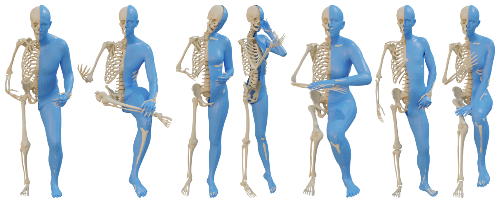

# OSSO: Obtaining Skeletal Shape from Outside (CVPR 2022)

This repository contains the official implementation of the skeleton inference from:

**OSSO: Obtaining Skeletal Shape from Outside** <br>*Marilyn Keller, Silvia Zuffi, Michael J. Black and Sergi Pujades* <br>[Full paper](https://download.is.tue.mpg.de/osso/OSSO.pdf) | [Project website](https://osso.is.tue.mpg.de/index.html#Dataset) 


Given a body shape with SMPL or STAR topology (in blue), we infer the underlying skeleton (in yellow).



## Installation
Please follow the installation instruction in [installation.md](installation.md) to setup all the required packages and models.


## Run skeleton inference

The skeleton can be inferred either from a [SMPL](https://smpl.is.tue.mpg.de/) or [STAR](https://github.com/ahmedosman/STAR) mesh.

``` 
python main.py  --mesh_input data/demo/body_female.ply --gender female -D -v
```

The final infered skeleton will be saved in the `out` folder and the intermediate meshes in `out/tmp`.


## Citation

If you find this model & software useful in your research, please consider citing:

```
@inproceedings{Keller:CVPR:2022,
  title = {{OSSO}: Obtaining Skeletal Shape from Outside},
  author = {Keller, Marilyn and Zuffi, Silvia and Black, Michael J. and Pujades, Sergi},
  booktitle = {Proceedings IEEE/CVF Conf.~on Computer Vision and Pattern Recognition (CVPR)},
  month = jun,
  year = {2022},
  month_numeric = {6}}
```

## Acknowledgements

OSSO uses the [Stitched Puppet](https://stitch.is.tue.mpg.de/) by Silvia Zuffi and Michael J. Black, and the body model [STAR](https://github.com/ahmedosman/STAR) by Ahmed Osman et al. The model was applied on [AGORA](https://agora.is.tue.mpg.de/) (Priyanka Patel et al.) for demonstration.

This research has been conducted using the UK Biobank Resource under the Approved Project ID 51951. The authors thank the International Max Planck Research School for Intelligent Systems for supporting Marilyn Keller. Sergi Pujades’ work was funded by the ANR SEMBA project. We thank Anatoscope (www.anatoscope.com) for the initial skeleton mesh and useful discussions.

We also thank A. A. Osman for his helpful advice on body models, P. Patel for helping test OSSO on AGORA, T. McConnel, Y. Xiu, S. Tripathi and T. Yin for helping with the submission and release, and P. Ghosh, J. Tesch, A. Chandrasekaran, V. F. Abrevaya, S. Sanyal, O. Ben-Dov and P. Forte for fruitful discussions, advice and proofreading. 


## License

This code and model are available for non-commercial scientific research purposes as defined in the [LICENSE.txt](LICENSE.txt) file.


## Contact

For more questions, please contact osso@tue.mpg.de

For commercial licensing, please contact ps-licensing@tue.mpg.de